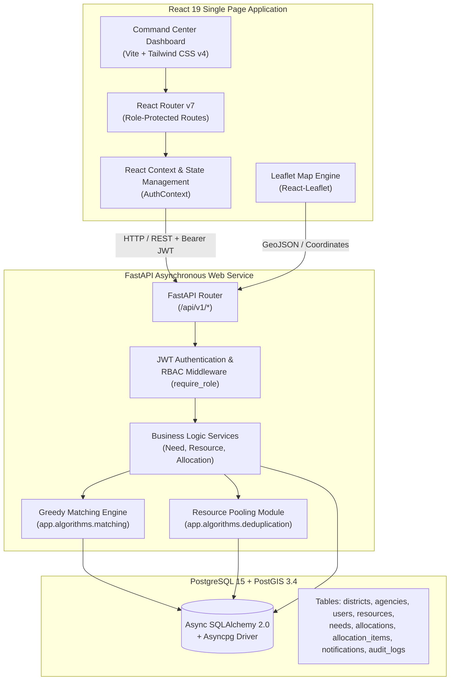

# SAHAYOG — Unified Multi-Agency Resource Deduplication & Relief Allocation Platform

[](https://github.com/)
[](https://github.com/)
[](https://www.python.org/)
[](https://fastapi.tiangolo.com/)
[](https://react.dev/)
[](https://www.postgresql.org/)

**SAHAYOG** is an enterprise-grade emergency operations platform engineered for multi-agency disaster relief management. It provides real-time cross-agency resource pooling, automated inventory deduplication, distance and urgency-weighted greedy matching, strict Role-Based Access Control (RBAC), interactive GIS spatial visualization, and immutable audit logging.

---

## Overview

### Problem Statement
During severe natural disasters (such as flash floods in the Hadoti region of Rajasthan), emergency relief efforts involve multiple independent operating entities—including the National Disaster Response Force (NDRF), State Disaster Response Force (SDRF), Indian Army, NGOs, and local government authorities. 

Without a centralized operational platform, key challenges emerge:
- **Inventory Hoarding & Duplication**: Multiple agencies stockpile identical items (e.g., drinking water, rescue boats) in the same district without cross-visibility.
- **Requisition Delays**: High-priority needs in emergency shelter camps go unfulfilled while available resources sit idle in nearby agency depots.
- **Lack of Authorization Controls**: Field dispatches lack verification, leading to inefficient routing and double-allocation.

### Solution
SAHAYOG centralizes multi-agency relief operations into a single State Emergency Operations Center dashboard. It aggregates disparate inventory, pools availability by district and resource type, automatically calculates requisition deadlines, runs a spatial Greedy Matching Engine, enforces a two-phase authorization workflow, and logs every state transition into an immutable audit trail.

### Target Roles & Stakeholders
1. **State Operations Officers (`STATE_OPERATOR`)**: Full command center visibility, matching engine execution, allocation authorization/rejection, and district-wide inventory balance monitoring.
2. **System Super Administrators (`SUPER_ADMIN`)**: Global administrative oversight across all agencies, districts, resources, and system logs.
3. **Agency Administrators (`AGENCY_ADMIN`)**: Agency-scoped management (NDRF, Indian Army, NGOs). Authorized to register and edit stock belonging strictly to their agency while retaining read-only visibility into multi-agency totals.
4. **Agency Field Staff (`AGENCY_STAFF`)**: Sector-level inventory maintenance within agency scope.

---

## Key Features

- **Unified Cross-Agency Resource Pooling**: Automatically groups resources by `(district_id, resource_type)` to display total available, reserved, and in-transit quantities alongside individual agency breakdowns.
- **Deadline-Driven Priority Classification**: Derives requisition urgency dynamically from UTC deadlines:
  - `CRITICAL`: $\le 2$ hours remaining
  - `HIGH`: $\le 6$ hours remaining
  - `MEDIUM`: $\le 24$ hours remaining
  - `LOW`: $> 24$ hours remaining
- **Greedy Matching Engine**: Matches open needs against available pooled resources using Euclidean/centroid distance calculations and stock availability, generating transactional allocation proposals (`AVAILABLE` $\rightarrow$ `RESERVED`).
- **Two-Phase Allocation Authorization Workflow**: Multi-agency dispatch proposals remain in `PROPOSED` state until authorized by a `STATE_OPERATOR` or `SUPER_ADMIN`. Accepting transitions stock to `IN_TRANSIT`; rejecting releases reserved stock back to `AVAILABLE`.
- **Role-Based Access Control (RBAC)**: Fine-grained permissions enforced at both FastAPI dependency layer and React UI layer. Restricts audit trail access and limits resource editing to owning agencies (`user.agency_id == resource.agency_id`).
- **Interactive GIS Operations Map**: Powered by React-Leaflet and PostGIS spatial coordinates, mapping district centroids, requisition points, resource depots, and active dispatch vectors.
- **Automated Event Notifications & Immutable Audit Trail**: DB-backed notification system and JSONB before/after state snapshot logging for complete post-disaster operational transparency.
- **Light Government Command Center UI**: Custom-designed light pastel blue operations interface optimized for high information density and zero visual distraction in emergency control rooms.

---

## System Architecture

SAHAYOG is built on a decoupled client-server architecture utilizing an asynchronous Python web backend, a relational PostGIS database, and a single-page React frontend.



### Data Flow & Matching Pipeline
1. **Requisition Submission**: Field officers or state operators register a Need specifying district, resource type, quantity required, and deadline.
2. **Priority Derivation**: The system automatically assigns a priority (`CRITICAL`, `HIGH`, `MEDIUM`, `LOW`) based on time remaining until deadline.
3. **Match Triggering**: An operator triggers the Greedy Matching Engine for an open Need.
4. **Candidate Selection & Locking**: Candidate resources (`status == 'AVAILABLE'`, `quantity_available > 0`, matching `resource_type`) are locked via SELECT FOR UPDATE.
5. **Distance & Availability Ranking**: Resources are ordered by proximity to the district centroid and available quantity.
6. **Proposal Creation**: A `PROPOSED` Allocation record and `AllocationItem` child rows are created. Resource stock is transactionally moved from `quantity_available` to `quantity_reserved`.
7. **Authorization**: A `STATE_OPERATOR` reviews the proposal and accepts it. The Need's `quantity_fulfilled` is updated, the Need status transitions to `PARTIALLY_MET` or `RESOLVED`, resource stock transitions to `IN_TRANSIT`, an operational Notification is emitted, and an entry is written to `audit_logs`.

---

## Tech Stack

| Component | Technology | Purpose |
| :--- | :--- | :--- |
| **Frontend Framework** | React v19.2 | Component-based user interface |
| **Build Tool & Server** | Vite v8.2 | Fast HMR and bundle compilation |
| **Styling** | Tailwind CSS v4.3 | Utility-first government operational UI design |
| **Routing** | React Router v7.18 | Client-side page navigation & protected routes |
| **GIS / Mapping** | Leaflet v1.9 + React-Leaflet v5.0 | Interactive spatial map rendering |
| **Icons** | Lucide React v1.31 | Technical iconography |
| **Backend Web Framework** | FastAPI v0.115 | Asynchronous RESTful API framework |
| **ASGI Web Server** | Uvicorn v0.34 | High-performance async server |
| **Database ORM** | SQLAlchemy v2.0 (AsyncIO) | Asynchronous Object-Relational Mapping |
| **Database Driver** | Asyncpg v0.30 | High-speed PostgreSQL async driver |
| **Database Engine** | PostgreSQL 15 + PostGIS 3.4 | Relational database with geospatial extensions |
| **Database Migrations**| Alembic v1.14 | Schema evolution and migration scripts |
| **Validation & Schemas**| Pydantic v2.10 | Data validation and JSON serialization |
| **Security / Auth** | Python-jose & Bcrypt | JWT authentication and password hashing |
| **Testing** | Pytest v8.3 + Pytest-Asyncio | Automated unit and integration test suite |

---

## Project Structure

```
sahayog-platform/
├── backend/
│   ├── app/
│   │   ├── api/
│   │   │   └── v1/             # API Router endpoints (auth, needs, resources, allocations, etc.)
│   │   ├── algorithms/         # Algorithmic modules (matching, deduplication, priority)
│   │   ├── core/               # App configuration, security JWT, and dependencies
│   │   ├── db/                 # Database engine setup and session creation
│   │   ├── models/             # SQLAlchemy ORM model definitions
│   │   ├── schemas/            # Pydantic v2 schemas for requests & responses
│   │   ├── services/           # Async business logic layer
│   │   └── main.py             # FastAPI entry point & CORS configuration
│   ├── alembic/                # Migration scripts
│   ├── tests/                  # Pytest test suite (105 passing tests)
│   ├── seed_data.py            # Database seeding script for Hadoti flood sector
│   ├── docker-compose.yml      # Container orchestration for FastAPI & PostGIS
│   └── requirements.txt        # Python backend dependencies
├── frontend/
│   ├── src/
│   │   ├── components/         # Layout components (MainLayout, Sidebar, TopBar)
│   │   ├── context/            # React AuthContext for session management
│   │   ├── pages/              # 10 Operational Views (Dashboard, Resources, Pool, Needs, etc.)
│   │   ├── services/           # Axios API client wrapper (api.js)
│   │   ├── utils/              # Permissions helper functions (permissions.js)
│   │   ├── App.jsx             # Router configuration & protected routes
│   │   └── index.css           # Global Tailwind CSS import & government theme overrides
│   ├── package.json            # Frontend dependencies
│   └── vite.config.js          # Vite build configuration
├── package.json                # Root concurrent scripts
└── README.md                   # Project documentation
```

---

## Installation & Setup

### Prerequisites
- **Node.js**: v18.0.0 or higher
- **Python**: v3.11.0 or higher
- **PostgreSQL**: v15 with **PostGIS** extension (or Docker Desktop)

---

### Option A: Quickstart with Docker Compose (Recommended)

1. **Clone the Repository**:
   ```bash
   git clone https://github.com/ggaurrii/Multi-Agency-Resource-Deduplication-Platform.git
   cd Multi-Agency-Resource-Deduplication-Platform
   ```

2. **Launch Services via Docker Compose**:
   ```bash
   docker compose -f backend/docker-compose.yml up --build -d
   ```
   *This starts the PostgreSQL + PostGIS container (`sahayog_db`) on port 5432 and the FastAPI server (`sahayog_api`) on port 8000.*

3. **Start the Frontend Locally**:
   ```bash
   cd frontend
   npm install
   npm run dev
   ```
   Open `http://localhost:5173` in your browser.

---

### Option B: Local Native Setup (Without Docker)

1. **Clone & Install Root Dependencies**:
   ```bash
   git clone https://github.com/ggaurrii/Multi-Agency-Resource-Deduplication-Platform.git
   cd Multi-Agency-Resource-Deduplication-Platform
   npm install
   ```

2. **Backend Setup**:
   ```bash
   cd backend
   python -m venv venv
   # On Windows:
   .\venv\Scripts\activate
   # On Linux/macOS:
   source venv/bin/activate

   pip install -r requirements.txt
   ```

3. **Database Migration & Seeding**:
   Ensure PostgreSQL/PostGIS is running locally with database `sahayog` created.
   ```bash
   # Apply migrations
   alembic upgrade head

   # Seed initial Hadoti flood sector data
   python seed_data.py
   ```

4. **Frontend Setup**:
   ```bash
   cd ../frontend
   npm install
   ```

5. **Run Application Concurrently**:
   From the project root:
   ```bash
   npm run dev
   ```
   - **Frontend UI**: `http://localhost:5173`
   - **Backend API**: `http://localhost:8000`
   - **Swagger Docs**: `http://localhost:8000/docs`

---

## Environment Variables

### Backend Configuration (`backend/.env`)

| Variable | Description | Default / Example Value |
| :--- | :--- | :--- |
| `APP_NAME` | Service Name | `SAHAYOG` |
| `APP_VERSION` | Service Version | `0.1.0` |
| `DEBUG` | Enable Debug Mode | `False` |
| `POSTGRES_USER` | Database Username | `sahayog` |
| `POSTGRES_PASSWORD` | Database Password | `sahayog_dev_password` |
| `POSTGRES_DB` | Database Name | `sahayog` |
| `POSTGRES_HOST` | Database Host | `db` *(or `localhost` for local dev)* |
| `POSTGRES_PORT` | Database Port | `5432` |
| `DATABASE_URL` | Async SQLAlchemy Connection String | `postgresql+asyncpg://sahayog:sahayog_dev_password@db:5432/sahayog` |
| `DATABASE_URL_SYNC` | Sync Connection String for Alembic | `postgresql+psycopg2://sahayog:sahayog_dev_password@db:5432/sahayog` |
| `JWT_SECRET_KEY` | Secret key for signing JWT tokens | `YOUR_SECURE_RANDOM_SECRET_KEY` |
| `JWT_ALGORITHM` | Token Signing Algorithm | `HS256` |
| `JWT_ACCESS_TOKEN_EXPIRE_MINUTES` | Access token lifespan | `30` |

### Frontend Configuration (`frontend/.env`)

| Variable | Description | Default Value |
| :--- | :--- | :--- |
| `VITE_API_BASE_URL` | Base URL for backend API | `http://localhost:8000/api/v1` |
| `VITE_DEV_MODE` | Fallback prototype mode flag | `false` |

---

## API Documentation

The backend provides comprehensive OpenAPI documentation available at `http://localhost:8000/docs` (Swagger UI) and `http://localhost:8000/redoc`.

### Authentication
- `POST /api/v1/auth/login`: Authenticates user and returns OAuth2 JWT access & refresh tokens.
- `GET /api/v1/auth/me`: Retrieves current authenticated user profile.
- `POST /api/v1/auth/logout`: Revokes refresh token and terminates session.

### Dashboard & Analytics
- `GET /api/v1/dashboard/summary`: Retrieves aggregated command center metrics (Critical Needs, Open Needs, Available Stock, In Transit, Allocations summary, and Unread Alerts).

### Resource Management
- `GET /api/v1/resources`: Lists physical resources with optional filters (`district_id`, `resource_type`, `status`, `agency_id`).
- `GET /api/v1/resources/pooled`: Returns cross-agency deduplicated stock grouped by district and resource type with agency breakdowns.
- `POST /api/v1/resources`: Registers new physical resource (`AGENCY_ADMIN` / `STATE_OPERATOR` / `SUPER_ADMIN`). Forced to user's agency for agency admins.
- `PATCH /api/v1/resources/{id}`: Updates resource quantities or status. Agency users can only update stock belonging to their agency.

### Needs & Requisitions
- `GET /api/v1/needs`: Lists emergency requisitions filtered by district, type, priority, or status.
- `POST /api/v1/needs`: Registers a new disaster requisition with auto-derived priority based on deadline.
- `PATCH /api/v1/needs/{id}`: Updates need details or manually adjusts fulfillment status.

### Matching & Allocation Workflow
- `POST /api/v1/allocations/match/{need_id}`: Triggers the Greedy Matching Engine for a specified need ID. Locks available candidate resources, computes distances, deducts `quantity_available`, increases `quantity_reserved`, and returns a `PROPOSED` allocation with child items.
- `GET /api/v1/allocations`: Lists allocations filtered by `need_id` or `status` (`PROPOSED`, `ACCEPTED`, `MODIFIED`, `REJECTED`).
- `POST /api/v1/allocations/{id}/authorize`: Accepts a proposed allocation, transitions resource stock to `IN_TRANSIT`, updates need fulfillment, emits notifications, and logs audit record (`STATE_OPERATOR` / `SUPER_ADMIN` only).
- `POST /api/v1/allocations/{id}/reject`: Rejects a proposed allocation and restores reserved stock back to `AVAILABLE` status (`STATE_OPERATOR` / `SUPER_ADMIN` only).

### Notifications & Audit Logs
- `GET /api/v1/notifications`: Lists operational system notifications and alerts.
- `GET /api/v1/audit-logs`: Retrieves immutable audit log events with JSONB state snapshots (`STATE_OPERATOR` / `SUPER_ADMIN` only).

### Health Checks
- `GET /health`: Liveness probe.
- `GET /health/db`: Database connectivity and PostGIS extension status check.

---

## Authentication & Demo Accounts

SAHAYOG enforces JWT Bearer Authentication and Role-Based Access Control. Five pre-seeded user accounts are available out-of-the-box for evaluation:

| User Role | Seeded Email | Default Password | Agency Scope | Key Permissions |
| :--- | :--- | :--- | :--- | :--- |
| **`STATE_OPERATOR`** | `rajesh.kumar@sdma.rajasthan.gov.in` | `StateOp@123` | Rajasthan SDMA | Full command access, Match engine, Authorize/Reject allocations, Audit logs |
| **`SUPER_ADMIN`** | `admin@sahayog.gov.in` | `Admin@123` | System Global | Complete administrative override across all agencies and system logs |
| **`AGENCY_ADMIN`** | `anil.sharma@ndrf.gov.in` | `NdrfAdmin@123` | NDRF Battalion 5 | Register/Edit NDRF resources; read-only multi-agency views |
| **`AGENCY_ADMIN`** | `vikram.singh@army.mil.in` | `ArmyAdmin@123` | Indian Army | Register/Edit Army resources; read-only multi-agency views |
| **`AGENCY_ADMIN`** | `priya.mehta@relieffoundation.org` | `NgoAdmin@123` | Relief Foundation | Register/Edit NGO resources; read-only multi-agency views |

---

## Testing

The repository contains an automated test suite verifying models, Pydantic schemas, priority classification algorithms, resource deduplication logic, and allocation workflow state transitions.

Run the test suite from the `backend/` directory:

```bash
# Set PYTHONPATH and execute pytest
$env:PYTHONPATH = "c:\Users\visha\OneDrive\Desktop\Techroaches\backend"; python -m pytest tests/ -v
```

### Test Coverage Summary
- **Total Test Cases**: `105 / 105 PASSED`
- **Modules Tested**: `test_models.py`, `test_need_schemas.py`, `test_resource_schemas.py`, `test_priority.py`, `test_seed_data.py`, `test_deduplication.py`, `test_matching.py`, `test_services_and_forecasting.py`.

---

## Deployment Considerations

- **Containerization**: The backend is containerized via `backend/docker-compose.yml` for multi-stage deployments.
- **Production Server**: In production, Uvicorn should be run behind a reverse proxy such as Nginx or Traefik with TLS termination.
- **PostGIS Configuration**: Ensure PostgreSQL instance has the PostGIS extension enabled (`CREATE EXTENSION IF NOT EXISTS postgis;`).
- **Frontend Static Assets**: The Vite production build (`npm run build`) generates optimized static files in `frontend/dist/` suitable for hosting on Nginx, Vercel, or AWS S3/CloudFront.

---

## Future Improvements

- **WebSockets Real-Time Telemetry**: Upgrade notification delivery from polling to full-duplex WebSockets.
- **OR-Tools Mathematical Optimization**: Integrate Google OR-Tools for multi-depot vehicle routing and optimal fleet distribution.
- **Scikit-Learn Demand Forecasting**: Train time-series regression models to predict regional resource deficits prior to disaster escalation.

---

## Contributors

- **Team Techroaches** — Lead Architecture & Platform Development

---

## License

License not specified.
